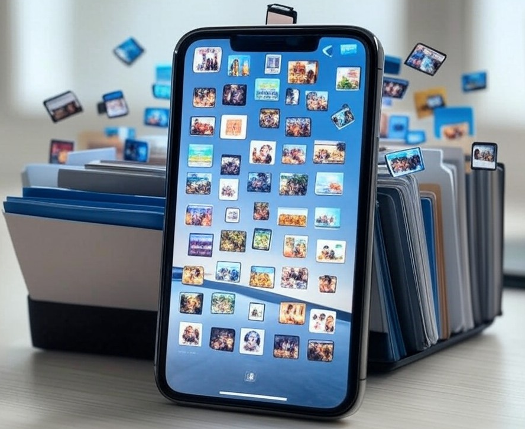

# iPhoneMediaSync

## Problem

- I use iPhone XR and now 16 to take pictures and movies
- I use [ifuse](https://github.com/libimobiledevice/ifuse) to copy all images from my iPhone to my hard-drive
  - These DCIM... folders contain all original images
  - Very many images i modify using iPhone and these images
    are stored in different path...
- See [connecting.md](connecting.md) for more information about how to connect iPhone to your computer if things
  don't work out of the box

### Example

- XXX is running number that starts from 100, lets use 102 in this example
- Originals path: /DCIM/103APPLE/Image_3942.heic
- IPhoneMediaSync path: /Photodata/Mutations/102APPLE/IMG_3942/Adjustements/FullSizeRender.heic
  - IPhoneMediaSync path contains image name as path
  - IPhoneMediaSync also contain Adjustements.plist that contain every adjustement you made in JSON format
  - Also note that if it's movie original and FullSizeRender suffix is mov

#### Plan

- I write a program that simply sync all images from the phone to PC
  - Program has simple config of input (mount point) and output
  - It will ignore originals, and only sync mutations if they exists
  - It will ignore already synced files
  - I can just plug in my iPhone and run the program, then I got all media up to date

##### Development

- Find [notes](NOTES.md) from my development process
